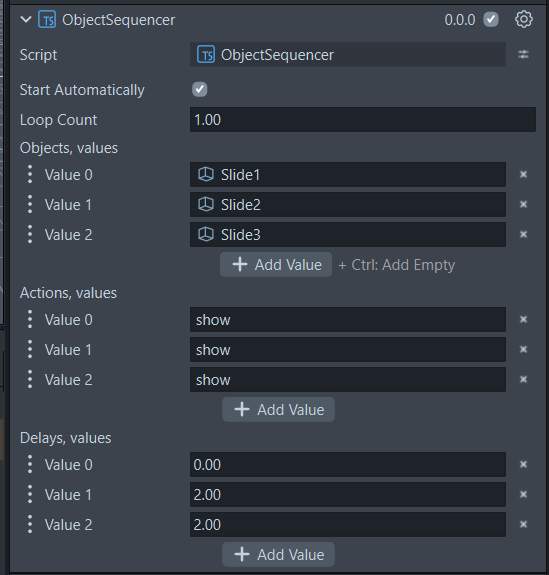

# Lens-Studio-Object-Sequencer
Easily sequence objects on a timer

## Getting Started

- Clone this repo and open the project in Lens Studio:
- To get the panels used in the demo, open the Asset Library inside Lens Studio and download **Spectacles Interaction Kit Examples version 0.16.4**.

## How It Works | What's in this Project

- The project uses a single script `ObjectSequencer.ts` which is added to an object in your scene which will serve as the sequencer. You fill in arrays in the Inspector to define your sequence. There's no coding required beyond dropping the script in.

- The script uses Lens Studio's built-in `DelayedCallbackEvent` to chain steps together with timers. The scene runs completely normally while the sequence plays.

- Try it out in this project & then add it to your own! This project has one sequencer for the 3 panels (Breathing in, Breathing out, and Good Job), a sequencer for the number count up and a sequencer for the count down (3 sequencers total!)

## Adding Sequencing To Your Own Project

### Step 1 | Add the 'ObjectSequencer.ts' script to your scene

- After playing around with this sample project, copy the ObjectSequencer.ts script and add it to your own project
- In the **Scene Hierarchy**, right-click and create a new empty SceneObject, name it 'Sequencer'
- In the **Inspector**, click **Add Component → Script**
- Assign `ObjectSequencer.ts` to it

### Step 2 | Fill in the three arrays
- For every object you want to start **hidden**, have it's visibility disabled in the Scene Hierarchy
- I store each "group" of objects into its own empty SceneObject, and name it for organization
- Now select your `Sequencer` object. In the Inspector you'll see three arrays on the `ObjectSequencer` component:

| Array | What to put in it |
|---|---|
| `objects` | Drag in your SceneObjects in the order you want them to show |
| `actions` | Optional, you can type `show` or `hide` for each object |
| `delays` | Type the number of seconds to wait before each step fires |

> **Important:** All three arrays must have the same number of entries.

## Example 

### Basic: three slides appearing one at a time

- Slide1 appears immediately, Slide2 appears 2 seconds later, Slide3 appears 2 seconds after that.

